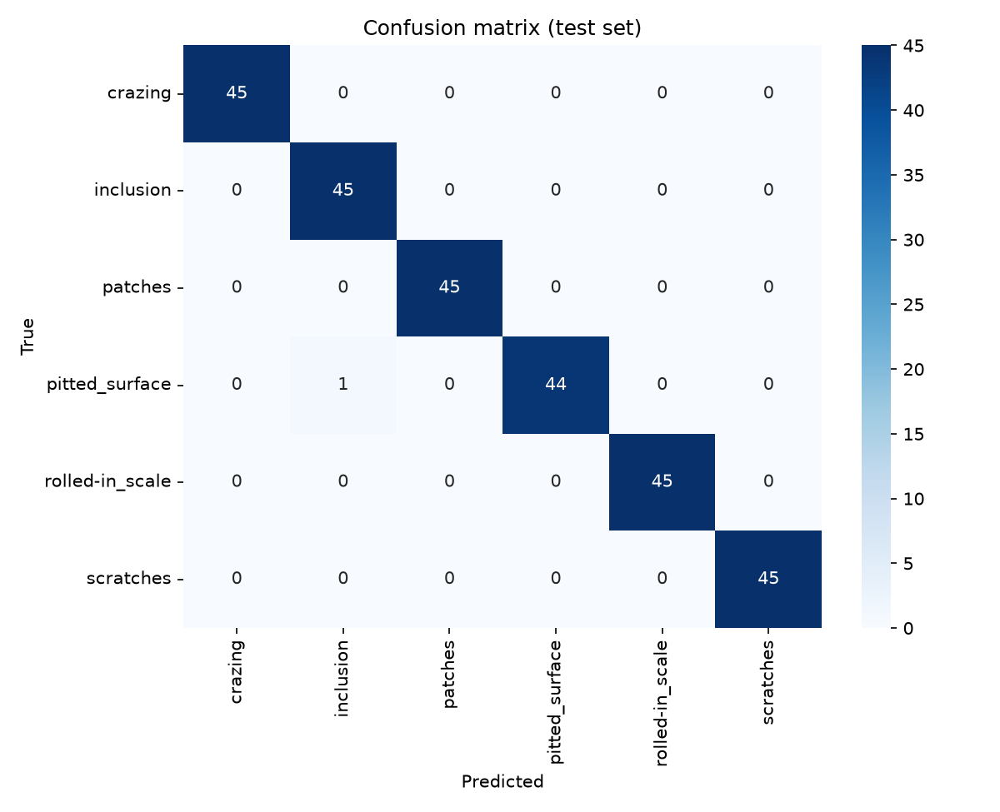
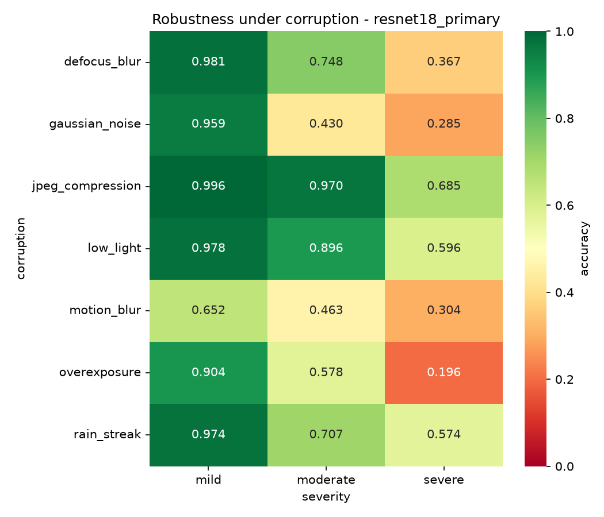
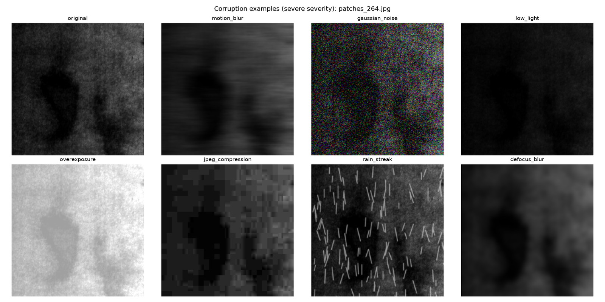
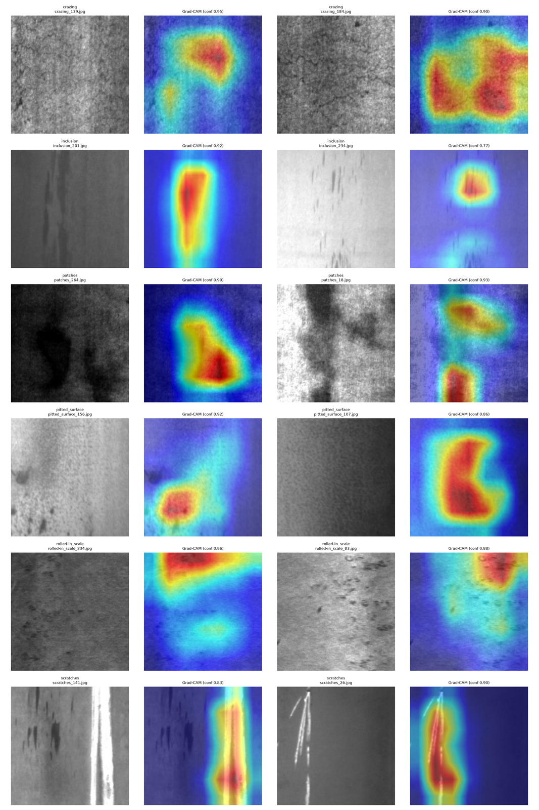
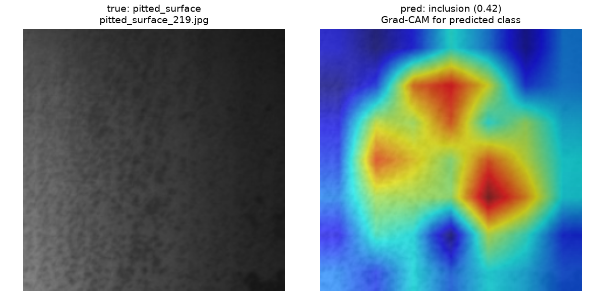
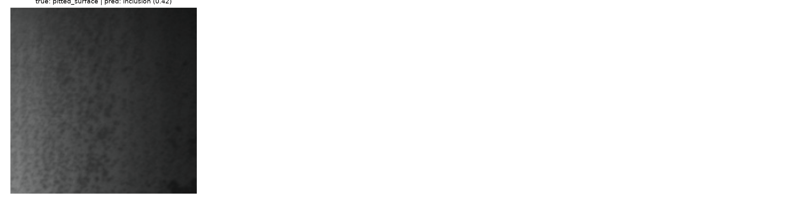
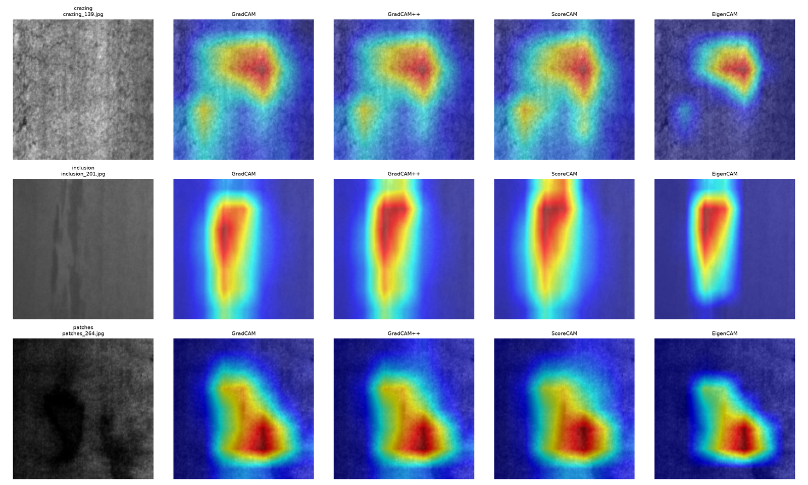

# Steel Surface Defect Classifier

A six-class surface-defect image classifier (NEU dataset) built as a proof-of-concept for the
visual-inspection layer of a pipeline-integrity workflow.

**Live demo:** TODO — not yet deployed to Hugging Face Spaces. The deployment bundle is prepared
and verified in [`deploy/`](deploy/), but the Space has not been created or pushed, so no permanent
URL exists yet. See [Reproduce it](#9-reproduce-it) to run the demo locally.

---

## 1. What this is

A ResNet18 classifier that assigns a steel surface image to one of six defect classes
(`crazing`, `inclusion`, `patches`, `pitted_surface`, `rolled-in_scale`, `scratches`), with
Grad-CAM saliency overlays and a corruption-robustness evaluation.

The intended contribution is not the headline accuracy — the dataset is small and clean enough
that high accuracy is expected. It is the **measured gap between clean-image accuracy and
accuracy under simulated field-imaging conditions**, which is reported in
[Section 6](#6-robustness-analysis).

## 2. Problem framing

Pipeline integrity management uses several inspection modalities. In-line inspection (ILI) tools —
magnetic flux leakage (MFL) and ultrasonic testing (UT) — measure wall loss, cracking, and
metal-loss geometry from inside the line. These are the authoritative sources for wall-thickness
and defect-depth assessment.

Separate from ILI, operators run **visual surveys**: above-ground inspections, right-of-way
patrols, drone and CCTV footage of exposed sections, station and riser inspections, and coating
condition surveys. These generate large volumes of imagery that is triaged manually.

This project targets that visual layer: automated triage to flag and categorise surface
conditions in inspection imagery, so reviewer attention goes to the frames that need it.

**It does not replace ILI.** It does not measure wall loss, defect depth, or remaining strength,
and produces no input to a fitness-for-service calculation. It complements the visual survey
workflow; MFL/UT remain the basis for integrity assessment.

## 3. Dataset

**NEU Surface Defect Database** — hot-rolled steel strip surface defects.

| Property | Value |
|---|---|
| Total images | 1,800 |
| Classes | 6 |
| Images per class | 300 (balanced) |
| Image size | 200 × 200 |
| Channels | Grayscale content; channel-replicated to 3 channels for ImageNet-pretrained backbones |

Classes: `crazing`, `inclusion`, `patches`, `pitted_surface`, `rolled-in_scale`, `scratches`.

**Splits** (stratified, frozen to `configs/splits.json`, generated once and reused by every script):

| Split | Images |
|---|---|
| Train | 1,260 |
| Validation | 270 |
| Test | 270 (45 per class) |

The test split is held out and is never used for training, model selection, early stopping, or
cross-validation. The 5-fold cross-validation in Section 5 runs over the combined train+val pool
only (1,530 images).

**Citation:** Song, K. and Yan, Y. (2013). A noise robust method based on completed local binary
patterns for hot-rolled steel strip surface defects. *Applied Surface Science*, 285: 858–864.

## 4. Method

**Transfer learning.** ImageNet-pretrained backbones via `timm`, with the classifier head resized
to 6 classes. The primary model is ResNet18.

**Training.** Config-driven (`configs/resnet18.yaml`): AdamW, OneCycleLR schedule, cross-entropy
with label smoothing 0.1, batch size 32, max 30 epochs, early stopping with patience 5, seed 42.
`src/train.py` also implements an optional two-stage mode (`--two-stage`: frozen-backbone head
warmup, then full fine-tuning with discriminative learning rates). The shipped checkpoint
(`models/best.pt`) records best validation accuracy 1.0000 at epoch 11.

**Augmentation** (`src/augment.py`, Albumentations 2.0.8) — applied to the training split only;
validation and test use resize + normalize with no augmentation:

- *Applied:* horizontal/vertical flip and 90° rotation (surface texture has no canonical
  orientation); brightness/contrast jitter, mild Gaussian noise and blur (approximating lighting
  rig and sensor variation); coarse dropout (partial occlusion).
- *Deliberately excluded:* elastic transform and grid distortion, which warp the fine crack
  morphology that defines `crazing`; hue/saturation jitter, which carries no signal on
  grayscale-derived images; aggressive random crops, which risk cropping the defect out of frame.

**Explainability.** Grad-CAM (`pytorch-grad-cam`) on the final residual block (`model.layer4[-1]`),
with GradCAM++/ScoreCAM/EigenCAM available for comparison.

## 5. Results

### Held-out test set (270 images)

Source: [`reports/results.csv`](reports/results.csv)

| Class | Precision | Recall | F1 | Support |
|---|---|---|---|---|
| crazing | 1.0000 | 1.0000 | 1.0000 | 45 |
| inclusion | 0.9783 | 1.0000 | 0.9890 | 45 |
| patches | 1.0000 | 1.0000 | 1.0000 | 45 |
| pitted_surface | 1.0000 | 0.9778 | 0.9888 | 45 |
| rolled-in_scale | 1.0000 | 1.0000 | 1.0000 | 45 |
| scratches | 1.0000 | 1.0000 | 1.0000 | 45 |
| **Accuracy** | | | **0.9963** | 270 |
| **Macro avg** | 0.9964 | 0.9963 | 0.9963 | 270 |

One misclassification in 270 test images: a single `pitted_surface` image predicted as
`inclusion`.



### 5-fold cross-validation

With only 1,800 images, a single split can be unrepresentative. Cross-validation over the
train+val pool (test split untouched) checks whether the single-split result depends on the
particular split.

Source: [`reports/cv_results.csv`](reports/cv_results.csv)

| Fold | Val accuracy | Macro F1 |
|---|---|---|
| 1 | 0.9935 | 0.9935 |
| 2 | 1.0000 | 1.0000 |
| 3 | 1.0000 | 1.0000 |
| 4 | 1.0000 | 1.0000 |
| 5 | 1.0000 | 1.0000 |
| **Mean ± SD** | **0.9987 ± 0.0029** | **0.9987 ± 0.0029** |

The low standard deviation indicates the single-split result is not an artefact of a favourable
split.

### Backbone comparison

Source: [`reports/benchmark.csv`](reports/benchmark.csv)

| Backbone | Test accuracy | Macro F1 | Parameters | Size (MB) | CPU latency (ms) | Train time (min) |
|---|---|---|---|---|---|---|
| resnet18 | 0.9963 | 0.9963 | 11,179,590 | 42.72 | 162.27 | 245.61 |
| mobilenetv3_small_100 | 1.0000 | 1.0000 | 1,524,006 | 5.94 | 397.39 | 131.34 |
| efficientnet_b0 | TODO | TODO | TODO | TODO | TODO | TODO |
| resnet50 | TODO | TODO | TODO | TODO | TODO | TODO |
| vit_tiny_patch16_224 | TODO | TODO | TODO | TODO | TODO | TODO |

**TODO:** Three of five backbones are unbenchmarked. On the development machine (8 GB RAM, CPU
only) the training process was repeatedly terminated by memory pressure; EfficientNetB0 and
ResNet50 could not complete enough consecutive work to make progress, and ViT-Tiny was not
started. Running `python -m scripts.benchmark_backbones` on a machine with more memory would fill
these rows — the script skips backbones already present in `reports/benchmark.csv`.

**The one comparison available is counterintuitive and worth stating.** MobileNetV3-Small has
7.3× fewer parameters and is 7.2× smaller on disk than ResNet18, yet its **CPU inference latency
is 2.4× worse** (397.39 ms vs 162.27 ms). The likely cause is that MobileNetV3's
depthwise-separable convolutions are designed for mobile NPUs and ARM inference, whereas on
desktop x86 PyTorch's CPU kernels are far better optimised for ResNet's dense convolutions.
**Parameter count is not a proxy for latency on the target hardware** — which is the practical
lesson, since model choice for an edge deployment is often made on parameter count alone.

Two caveats on this table, both important:

- **The accuracy difference is not meaningful.** 1.0000 versus 0.9963 on a 270-image test set is a
  single image. Both models are saturated on clean data; this table cannot separate them on
  accuracy, and Section 6 argues corruption robustness is the more informative axis anyway.
- **MobileNetV3 was trained twice, and the runs disagreed.** Through an operator error, two
  training processes ran concurrently; the recorded run (131.34 min, accuracy 1.0000) supersedes
  an earlier run that early-stopped sooner (37.69 min, accuracy 0.9407). The table reports the run
  currently in `reports/benchmark.csv`. That a shorter run of the same architecture on the same
  frozen split landed 5.6 points lower is itself a caution: with 1,800 images, results are
  sensitive to how long training runs before early stopping, and single-run comparisons between
  backbones should be treated as indicative rather than definitive.

For CPU deployment on x86, ResNet18 remains the safer default on latency, which is the axis the
two models genuinely differ on. MobileNetV3 is preferable where storage or memory is the binding
constraint, and its latency ranking would likely invert on ARM hardware — untested here, and worth
measuring on the actual target device before any deployment decision.

## 6. Robustness analysis

NEU is clean, evenly lit, in-focus laboratory imagery. Field visual inspection is not. This
section measures how far accuracy falls under seven simulated corruptions at three severities,
evaluated on the held-out test set.

Source: [`reports/robustness.csv`](reports/robustness.csv) (backbone: `resnet18_primary`)

Clean baseline accuracy: **0.9963**

| Corruption | Mild | Moderate | Severe |
|---|---|---|---|
| motion_blur | 0.6519 | 0.4630 | 0.3037 |
| gaussian_noise | 0.9593 | 0.4296 | 0.2852 |
| low_light | 0.9778 | 0.8963 | 0.5963 |
| overexposure | 0.9037 | 0.5778 | 0.1963 |
| jpeg_compression | 0.9963 | 0.9704 | 0.6852 |
| rain_streak | 0.9741 | 0.7074 | 0.5741 |
| defocus_blur | 0.9815 | 0.7481 | 0.3667 |

**Mean accuracy across all 21 corrupted conditions: 0.6783**
**Mean corruption accuracy drop: 0.3180 (31.80 percentage points)**

By severity:

| Severity | Mean accuracy | Drop from clean |
|---|---|---|
| Mild | 0.9206 | 0.0757 |
| Moderate | 0.6847 | 0.3116 |
| Severe | 0.4296 | 0.5667 |

By corruption type (averaged over severities, worst first):

| Corruption | Mean accuracy | Drop from clean |
|---|---|---|
| motion_blur | 0.4728 | 0.5235 |
| gaussian_noise | 0.5580 | 0.4383 |
| overexposure | 0.5593 | 0.4370 |
| defocus_blur | 0.6988 | 0.2975 |
| rain_streak | 0.7519 | 0.2444 |
| low_light | 0.8235 | 0.1728 |
| jpeg_compression | 0.8840 | 0.1123 |




### Conclusion: the lab-to-field gap

A model that is effectively saturated on clean test data (99.63%, one error in 270) loses roughly
a third of its accuracy on average across simulated field conditions, and drops to 42.96% at
severe corruption — approaching the range where predictions carry little information for a
six-class problem.

The failure profile is specific and actionable:

- **Motion blur and defocus are the most damaging.** This is the dominant risk for drone-mounted
  or handheld capture. Camera stabilisation and focus confirmation matter more than model choice.
- **Overexposure is more damaging than underexposure.** At severe level, overexposure gives
  0.1963 while low light gives 0.5963. Blown highlights destroy the texture the model relies on;
  darkened images retain recoverable contrast. This argues for exposure control biased toward
  underexposure in bright outdoor conditions.
- **JPEG compression is comparatively benign** (0.8840 mean, 0.9704 even at moderate). Transmission
  bandwidth constraints are unlikely to be the limiting factor.

The practical implication is that in-distribution accuracy on a clean benchmark does not predict
field performance, and capture quality control is a first-order concern for any real deployment.

### Comparison with published work

Olorunnisola & Oluwatimilehin (*Int. J. Adv. Manuf. Technol.* 143:2545–2558, 2026) report that
models scoring 100% in-distribution on this dataset can be fragile out-of-distribution, and find
EfficientNetB0 the most resilient among the backbones they compared.

**Our result agrees with the general finding.** A model at 99.63% clean accuracy degrades to
67.83% mean corrupted accuracy — the in-distribution figure does not transfer.

**Their specific EfficientNetB0 claim cannot be evaluated here: TODO.** That claim is comparative
across backbones, and `efficientnet_b0` could not be trained to completion on the development
machine (see Section 5). `reports/robustness.csv` contains results for `resnet18_primary` only.

A cross-backbone comparison against MobileNetV3-Small was attempted but also could not complete:
each corruption cell is a full 270-image test-set evaluation, and the process was terminated
during startup before finishing one. Both scripts resume from partial progress
(`scripts/robustness_test.py` records each grid cell as it completes, and skips cells already
present), so running them on a machine with more memory would fill this in without repeating
finished work.

**No claim is made here about which backbone degrades least**, and the cited EfficientNetB0
finding is neither confirmed nor contradicted by this project.

## 7. Explainability

Grad-CAM overlays showing which image regions drive each prediction.

**By class:**



**Failure cases** — the misclassified and lowest-confidence examples:




**Method comparison** (GradCAM / GradCAM++ / ScoreCAM / EigenCAM):



The failure figures are included deliberately. On correctly classified images the saliency
generally covers the defect region; on failures it is more diffuse or attends to background
texture. Grad-CAM here is a debugging and review aid, not a validated defect-localisation output —
it produces no bounding box, area, or depth measurement.

## 8. Scope, limitations, and path to real pipeline data

**Read this section before citing any number above.**

### What the model was trained on

Hot-rolled steel strip surface defects, photographed under controlled laboratory conditions. It
was **not** trained on in-service pipeline imagery: not on external pipe surfaces, coatings,
girth welds, corrosion under insulation, or any right-of-way or subsea footage. No image in the
training, validation, or test set came from an operating pipeline.

### What the defect classes do and do not mean

The six NEU classes are steel-strip manufacturing defect categories. They have *analogues* in
pipeline integrity vocabulary — `crazing` resembles the surface presentation of stress-corrosion
cracking, `pitted_surface` resembles pitting corrosion — but they are **not the same taxonomy**.
The plain-English descriptions in the demo app are explanatory analogies for a non-specialist
audience, not an assessment mapping. A model trained on these labels does not detect
stress-corrosion cracking or pitting corrosion on a pipeline.

### What is demonstrated

A methodology: leakage-controlled dataset splitting, transfer learning, an augmentation strategy
justified by domain reasoning, cross-validation to test split sensitivity, saliency-based
explainability including failure analysis, corruption-robustness evaluation, and a deployable
inference path (ONNX export, CPU inference, hosted demo). That methodology would transfer to a
real pipeline visual dataset. **The trained weights would not.**

### What real deployment would require

1. **Field imagery collection and labelling.** A dataset of in-service pipeline visual inspection
   imagery, labelled by qualified inspectors against an operator-approved defect taxonomy. This is
   the single largest cost and the binding constraint.
2. **Domain adaptation or retraining.** The lab-to-field gap measured in Section 6 is for
   *simulated* corruption of lab images. The real domain gap — different surfaces, coatings,
   lighting, scale, backgrounds, weather — is larger and is not measured anywhere in this
   repository.
3. **Capture quality control.** Section 6 shows motion blur and overexposure are the dominant
   failure modes. Any deployment needs capture standards and automatic rejection of unusable
   frames.
4. **Integration with, not replacement of, ILI.** Output would enter the visual survey triage
   workflow. It would not feed fitness-for-service, remaining-strength, or reassessment-interval
   calculations, which remain based on MFL/UT ILI data and direct examination.
5. **Calibration and operating-point selection.** Reported accuracy uses argmax. A real system
   needs a confidence threshold chosen against an explicit false-negative tolerance, since a
   missed defect and a false alarm have very different costs.
6. **Human-in-the-loop review and audit.** Predictions would be reviewer aids with logged
   provenance, not autonomous decisions.

### Statement of status

**Every result in this repository is a proof-of-concept on public laboratory data.** No claim is
made about performance on pipeline imagery. Nothing here is validated for operational integrity
decision-making.

### Other known limitations

- **Small dataset.** 1,800 images, 270 in test. A single test error moves accuracy by 0.37
  percentage points; treat differences smaller than that as noise.
- **Balanced classes.** 300 images per class. Real inspection data is heavily imbalanced —
  most frames contain no defect at all.
- **No "no defect" class.** The model assigns one of six defect labels to every input. It cannot
  report "clean surface" or "unknown", and will confidently label an out-of-domain image.
  Section 6's severe-corruption results show this failure mode directly.
- **Single-label, whole-image.** No detection, no segmentation, no multiple defects per image, no
  defect sizing.
- **Benchmark incomplete.** Three of five backbones unfinished (Section 5), limited by the
  development machine rather than by method.
- **Robustness tested on one backbone.** The corruption analysis covers `resnet18_primary` only;
  the cross-backbone comparison and the cited EfficientNetB0 resilience claim remain TODO
  (Section 6).
- **Latency measured on one machine.** All CPU latency figures come from a single desktop x86
  machine. As Section 5 shows, relative latency between architectures can invert on different
  hardware, so these numbers should not be used to choose a backbone for a different target.

## 9. Reproduce it

Requires Python 3.11. The pinned environment is CPU-only.

```bash
# Setup
python -m venv .venv
.venv\Scripts\activate          # Windows
# source .venv/bin/activate     # Linux/macOS
pip install -r requirements.txt

# Data — download the NEU Surface Defect Database into data/raw/
# (requires a Kaggle API token at ~/.kaggle/kaggle.json; the script prints
# manual fallback sources if the Kaggle CLI is unavailable)
python scripts/download_data.py

# Verify the download: detects dataset variant, counts classes, checks integrity
python scripts/verify_data.py

# Train
python -m src.train --config configs/resnet18.yaml
python -m src.train --config configs/resnet18.yaml --smoke-test   # fast sanity check
python -m src.train --config configs/resnet18.yaml --two-stage    # optional two-stage mode

# Evaluate on the held-out test split -> reports/results.csv, confusion matrix
python -m src.evaluate --ckpt models/best.pt

# Cross-validation -> reports/cv_results.csv
python -m src.cross_validate

# Explainability figures -> reports/figures/gradcam_*.png
python scripts/viz_gradcam.py

# Robustness grid -> reports/robustness.csv, heatmap, examples
python -m scripts.robustness_test

# Backbone benchmark -> reports/benchmark.csv  (long-running: ~4h per backbone on CPU)
python -m scripts.benchmark_backbones

# ONNX export with PyTorch-parity verification (tolerance 1e-4)
python -m src.export --ckpt models/best.pt --out models/best.onnx

# Run the demo locally -> prints a local and a temporary public URL
python app/app.py

# Tests
pytest -q
```

Notes:

- Set `NO_ALBUMENTATIONS_UPDATE=1` to skip Albumentations' network version check, which can hang
  startup on a slow or restricted connection.
- All randomness is seeded through `src.utils.set_seed(42)`. Splits are frozen in
  `configs/splits.json`, which is committed to the repository so every script — and every
  reproduction — sees identical splits. It was generated once via `src.dataset.make_splits`
  (stratified, seed 42) and `src.dataset.save_splits`; regenerating it is deliberately not part
  of the normal workflow, since changing splits would invalidate comparison against the results
  reported above.

### Hugging Face Spaces deployment

`deploy/` contains a self-contained Space bundle: `app.py` with flat imports and no dependency on
the `src` package, `requirements.txt` pinned to the CPU torch wheel index, `models/best.pt`,
`examples/`, and a `README.md` with the required YAML frontmatter. Verified to import and build
its Gradio interface from inside `deploy/` with no `src/` on `sys.path`.

To publish (create the Space first at https://huggingface.co/new-space, SDK: Gradio):

```bash
cd deploy
git init
git lfs install
git lfs track "*.pt"          # models/best.pt is ~44 MB
git add .gitattributes && git add .
git commit -m "Steel surface defect classifier demo"
git remote add origin https://huggingface.co/spaces/<username>/<space-name>
git push -u origin main
```

**Status: not yet pushed.** No remote is configured and the Space has not been created, so the
build has not been confirmed.

## 10. References

1. Song, K. and Yan, Y. (2013). A noise robust method based on completed local binary patterns for
   hot-rolled steel strip surface defects. *Applied Surface Science*, 285: 858–864.
2. He, Y., Song, K., Meng, Q. and Yan, Y. (2020). An end-to-end steel surface defect detection
   approach via fusing multiple hierarchical features. *IEEE Transactions on Instrumentation and
   Measurement*, 69(4): 1493–1504.
3. Selvaraju, R. R., Cogswell, M., Das, A., Vedantam, R., Parikh, D. and Batra, D. (2017).
   Grad-CAM: Visual explanations from deep networks via gradient-based localization.
   *Proceedings of the IEEE International Conference on Computer Vision (ICCV)*, 618–626.
4. Olorunnisola, S. and Oluwatimilehin, O. (2026). *International Journal of Advanced
   Manufacturing Technology*, 143: 2545–2558. (Referenced in Section 6 for the
   out-of-distribution fragility finding.)
